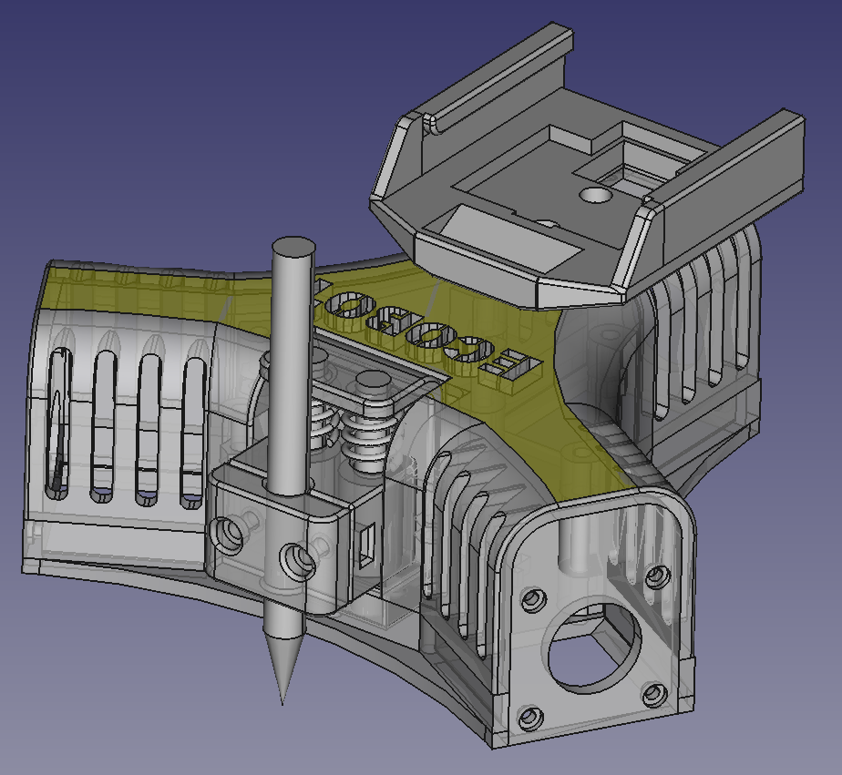
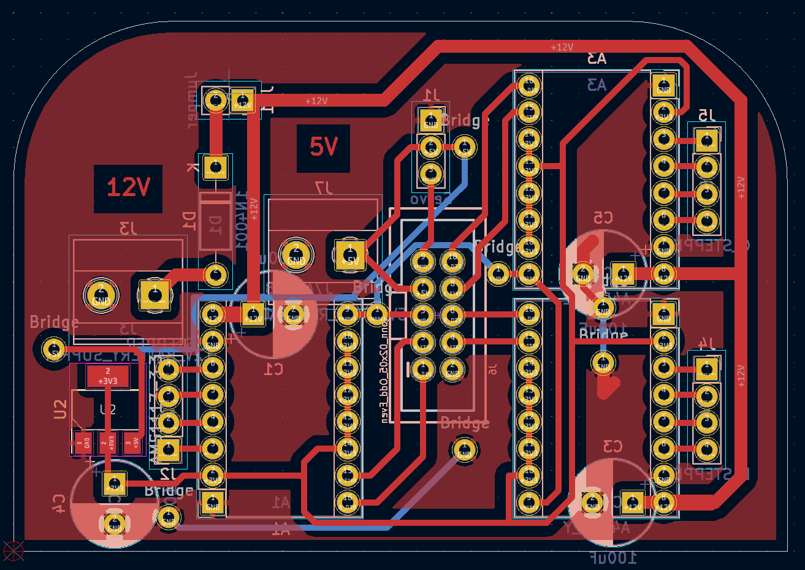
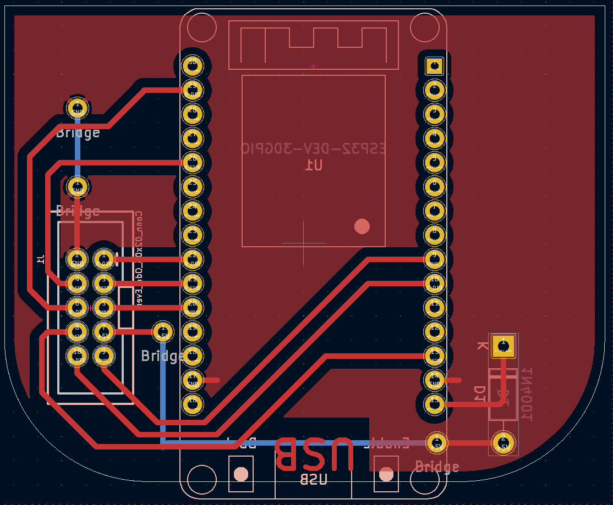

# Ecobot :: A robot that draws stuff

Included in the repo are:

- CAD files created with [Freecad](https://www.freecadweb.org).
- PCB files created with [Kicad](https://www.kicad.org/).

Projects used:

- The [ESP32 port](https://github.com/bdring/Grbl_Esp32) of the great [GRBL](https://github.com/gnea/grbl) CNC controller firmware.
- [BCNC](https://github.com/vlachoudis/bCNC) command sender, autoleveler, g-code editor, digitizer, CAM and swiss army knife for all your CNC needs.

